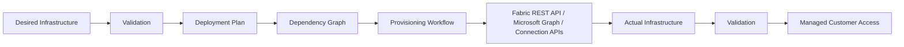
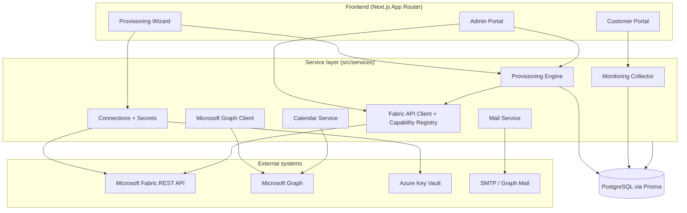
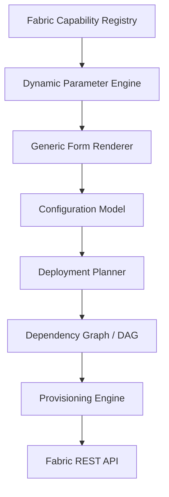
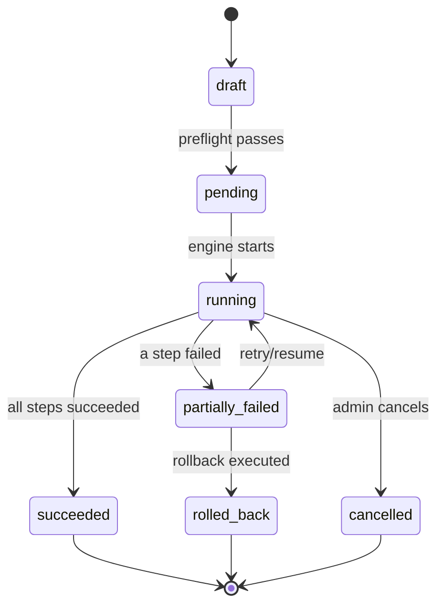
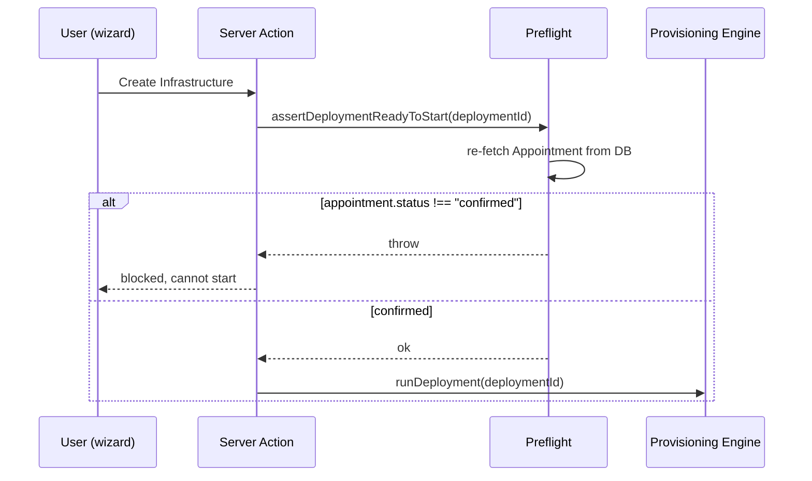
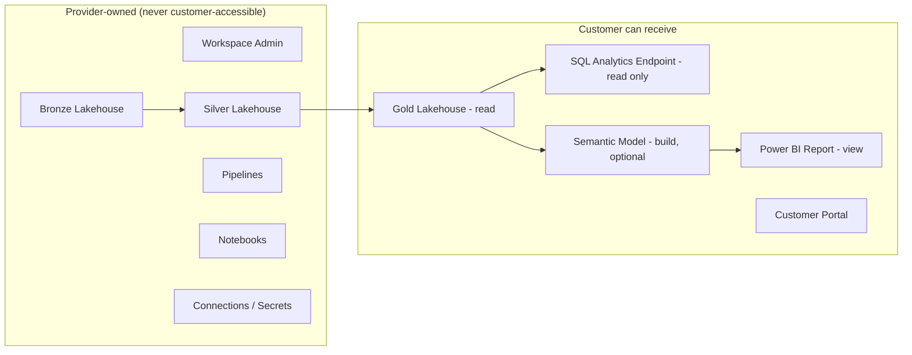

# Architecture

OneClick Fabric Infrastructure is a **Fabric provisioning control plane**, not a CRUD
app. Customers configure a desired data platform; the platform reconciles that desire
against real Microsoft Fabric infrastructure it owns and operates, and exposes customers
only a curated, read-only slice of the result.

## Bounded contexts

## Provisioning pipeline (mandatory abstractions)

Every piece below is required architecture, not incidental structure — see the product
brief's explicit "this abstraction is mandatory" callouts.

- **Fabric Capability Registry** (`FabricCapability`/`FabricParameterSchema`,
  `services/fabric/capability-registry.ts`) — no Fabric item type is hardcoded into a
  React component; see `docs/FABRIC_API.md` for how to add a new one.
- **Dynamic Parameter Engine** — one generic form renderer driven by parameter schema
  rows, not `LakehouseForm.tsx`/`PipelineForm.tsx`/etc.
- **Desired State Resource Model** (`DesiredResource`/`ActualResource`,
  `services/provisioning/*`) — the provisioning engine reconciles desired vs. actual
  state; this is what makes idempotency (section 30) and retry (section 29) possible.
  `ActualResource` existing for a `DesiredResource` means "skip create", checked before
  every Fabric call in `steps/create-fabric-item.ts` / `create-workspace.ts`.
- **DAG** (`services/provisioning/dag.ts`) — Kahn's-algorithm topological sort +
  explicit cycle detection (`CircularDependencyError`) before any plan is shown or
  executed; unit-tested in `tests/unit/dag.test.ts`.
- **Provisioning Engine** (`services/provisioning/engine.ts`) — a durable job
  abstraction backed by Postgres today (`Deployment`/`DeploymentStep` rows are the
  durable state). Deliberately designed so a future swap to Temporal/Trigger.dev only
  touches *what calls* `runDeployment()`, never the step definitions or domain model.

## Deployment state machine

`DesiredResource.status` moves through `pending → validating → ready → running →
succeeded|failed|skipped`, and `rollback_pending → rolled_back` when a rollback runs
(`services/provisioning/rollback.ts`). A dependency that fails blocks its dependents
(marked `skipped`, never silently executed out of order) — see `engine.ts`'s
`blockedLogicalNames` tracking.

## The mandatory appointment gate

The check (`services/provisioning/preflight.ts`) is re-derived from the database on
every call — never trusted from client input — and is invoked both by the UI's "Create"
action and independently inside `runDeployment()` itself, so there is no code path that
starts provisioning without it.

## Customer access boundary

Enforced in code, not just documentation: `CustomerAccess.fabricRole` is only ever
`"Viewer"` for customer-facing grants (see the regression test in
`tests/unit/customer-access.test.ts`), and the customer portal only ever queries
Gold-scoped/SQL-endpoint/report data — it has no code path that reads Bronze/Silver or
pipeline/notebook internals.

## Multi-file Prisma schema

The schema lives under `prisma/schema/*.prisma` (Prisma's multi-file schema feature),
grouped by bounded context: `auth`, `customer`, `service` (agents/appointments),
`fabric_registry`, `blueprint`, `configuration` (desired/actual state),
`connection`, `ingestion`, `provisioning`, `access`, `data` (SQL/monitoring/catalog),
`notification`, `audit`. See `docs/DEVELOPMENT.md` for the local setup and
`docs/DEPLOYMENT.md` for migrations.

## Known limitation: dev/test/prod environment fan-out

`InfrastructureConfiguration.environmentMode` supports `single` and `dev_test_prod`, and
the Prisma model is ready for it, but `services/provisioning/planner.ts` currently plans
a single `"PROD"` environment regardless of the selected mode. Extending the planner to
generate three parallel resource sets (one per environment, still sharing one
`Blueprint`) is a contained follow-up — the DAG/engine/idempotency machinery already
supports it without changes, since it operates per-`Deployment`.
